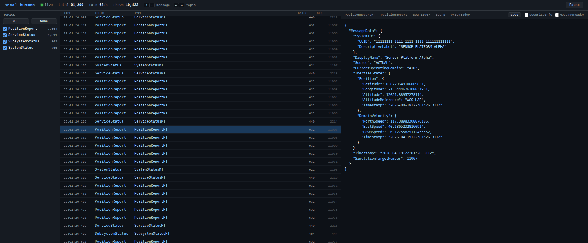

# arcal-busmon

`arcal-busmon` is a lightweight DDS bus monitor for ARCAL's opaque UCI payload
topics. It discovers live ARCAL topics, decodes payloads through the generated
CDR and JSON externalizers, writes per-topic JSON logs, and can stream message
metadata to the browser UI.



## Quick Start

Build the monitor:

```bash
cmake --build build
```

Start the web UI:

```bash
./busmon-ui.sh
```

The launcher sets `CYCLONEDDS_URI` for `arcal-busmon` using ARCAL's bundled
loopback Cyclone DDS config:

```bash
../arcal/test/e2e/cyclonedds_localhost.xml
```

This keeps the monitor on the same single-host DDS discovery settings used by
ARCAL's tests and demo publishers. If you run `build/arcal-busmon` directly,
export `CYCLONEDDS_URI` yourself before starting it.

For stream-level diagnostics:

```bash
./busmon-ui.sh --debug-stream
```

The UI defaults to port `8765` and logs decoded JSON under `/tmp/busmon-out`.

## Demo Publisher

The ARCAL demo publisher can feed the UI with basic platform/status traffic:

```bash
cd ../arcal
ninja -C build e2e_pub_continuous
export CYCLONEDDS_URI="file://$PWD/test/e2e/cyclonedds_localhost.xml"
./build/test/e2e/e2e_pub_continuous \
  --rate 50 \
  --system-rate 5 \
  --service-rate 10 \
  --subsystem-rate 2
```

That is the same Cyclone DDS config that `../arcal-busmon/busmon-ui.sh` applies
to the monitor. When running both processes manually, use the same
`CYCLONEDDS_URI` value for both:

```bash
cd ../arcal
export CYCLONEDDS_URI="file://$PWD/test/e2e/cyclonedds_localhost.xml"
../arcal-busmon/build/arcal-busmon --log-dir /tmp/busmon-out &
./build/test/e2e/e2e_pub_continuous \
  --rate 50 \
  --system-rate 5 \
  --service-rate 10 \
  --subsystem-rate 2
```

That produces `PositionReport`, `SystemStatus`, `ServiceStatus`, and
`SubsystemStatus` messages with `MessageHeader.Mode` set to `SIMULATION`.
